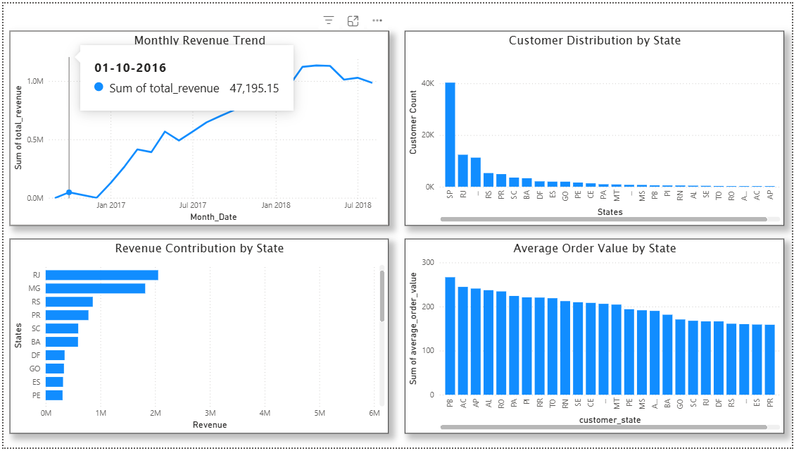

# 📊 Brazilian E-Commerce Business Analysis using SQL

---

## 🔹 Project Overview

This project presents a SQL-based analysis of Brazilian e-commerce transaction data to understand customer purchasing behavior, revenue trends, and regional performance. The analysis is supported by a Power BI dashboard to visualize key insights. The objective is to identify revenue drivers, evaluate customer distribution, and uncover opportunities for business growth and operational improvement.

---

## 🎯 Business Objectives

- Analyze revenue trends and business growth over time  
- Understand customer distribution and purchasing behavior  
- Evaluate delivery performance and operational efficiency  
- Identify dominant payment methods and customer preferences  
- Detect whether revenue is concentrated among top customers (Pareto analysis)  

---

## 🛠️ Tools Used

- **MySQL** – Data extraction and analysis  
- **MySQL Workbench** – Query execution and database management  
- **Power BI** – Data visualization and dashboard creation  

---

## 📂 Dataset Overview

The project uses the Brazilian E-commerce (Olist) dataset, which contains transaction-level data including customer details, order information, product-level sales, and payment records. The dataset is relational and consists of multiple interconnected tables representing the complete e-commerce workflow.

---

## 🗂️ Tables Used

### 🔹 customers  
Contains customer-level information such as `customer_id`, `customer_unique_id`, and geographic details (city, state, zip code).  
- `customer_id` → unique per order  
- `customer_unique_id` → identifies actual customers (used for repeat analysis)

### 🔹 orders  
Contains order lifecycle data including purchase timestamp, approval date, delivery timeline, and estimated delivery dates. Used for time-based and delivery performance analysis.

### 🔹 order_items  
Contains product-level transaction data such as `product_id`, `seller_id`, `price`, and `freight_value`. Used for revenue calculations and product analysis.

### 🔹 payments  
Contains payment-level data including `payment_type`, `payment_installments`, and `payment_value`. Used to analyze customer payment behavior and revenue contribution by payment methods.

---

## 📊 Dashboard Overview

The analysis is visualized using a Power BI dashboard to provide an interactive view of business performance.

### Key Visuals:

- **Monthly Revenue Trend** – Tracks revenue growth and seasonality over time  
- **Revenue Contribution by State** – Identifies top-performing regions  
- **Customer Distribution by State** – Shows geographic customer spread  
- **Average Order Value (AOV) by State** – Highlights regional customer value differences  

<p align="center">
  
</p>
---

## 🔍 Key Insights

### 📈 Revenue Growth & Seasonality  
Revenue shows a strong upward trend with noticeable seasonal spikes, particularly during peak months like November. This indicates demand-driven fluctuations, highlighting the need for optimized inventory and marketing strategies during high-demand periods.

### 🌍 Revenue Concentration by State  
Revenue is highly concentrated in the top 5 states, contributing over 73% of total revenue. This highlights a strong dependence on key regions, indicating the need to strengthen operations in these areas while exploring growth opportunities in underperforming regions to reduce dependency risk.

### 👥 Customer Distribution  
Customer base is heavily concentrated in a few key states, indicating strong market presence in specific regions. This highlights opportunities for geographic expansion into underpenetrated areas.

### 💰 Customer Revenue Distribution  
Revenue is not concentrated within a small group of customers but is widely distributed across the customer base. This indicates a balanced revenue contribution with lower dependency on high-value customers, while also highlighting an opportunity to identify and develop high-value customer segments.

### 💳 Payment Behavior  
Credit cards dominate both transaction volume and revenue contribution, indicating strong customer preference for card-based payments. This suggests that targeted offers such as cashback or EMI options can further enhance revenue.

### 🚚 Delivery Performance  
Over 90% of orders are delivered on time, indicating efficient logistics operations. However, a small percentage of delays still exists, which can be optimized to further improve customer satisfaction.

---

## ⚙️ How to Run the Project

1. Open **MySQL Workbench** and connect to your database server  
2. Import the dataset into your database (`raw`)  
3. Open SQL files from the `queries` folder  
4. Execute queries using **Ctrl + Enter**  
5. View results in the output panel  

---

## 📁 Project Structure

```
ecommerce-sql-analysis/
│
├── data/
│   └── raw/
│       ├── customers.csv
│       ├── order_items.csv
│       ├── orders.csv
│       ├── payments.csv
│       └── README.md
│
├── queries/
│   ├── 01_data_validation.sql
│   ├── 02_revenue_analysis.sql
│   ├── 03_customer_analysis.sql
│   ├── 04_customer_distribution.sql
│   ├── 05_revenue_by_region.sql
│   ├── 06_delivery_performance.sql
│   ├── 07_payment_analysis.sql
│   ├── 08_additional_analysis.sql
│   └── 09_pareto_analysis.sql
│
├── outputs/
│   ├── charts/
│   ├── query_results/
│   └── dashboard/
│       └── README.md
│
└── README.md
```
